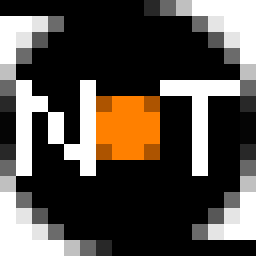

# NeoTape

<p align="center">
  
</p>

A seekable multi-volume length-framed payload transport container designed for LTO tape drives.

NeoTape wraps a payload byte stream (typically a POSIX pax/tar archive) in a
lightweight framing layer that provides per-frame structure, logical-slice
grouping, per-frame integrity verification via BLAKE3, optional Ed25519 frame
signatures backed by signify-compatible key files, and multi-volume
continuation. The on-tape format uses LTO filemarks at logical-slice
boundaries, enabling native tape seek to coarse checkpoint units without
requiring per-frame filemarks.

This is an early implementation-stage project. The current implementation
includes a standalone pax writer (`build/dev/bin/mt-pax`), a planner (`build/dev/bin/neotape-plan`)
for slicing metadata, long-running data producers (`build/dev/bin/neotape-archiver`,
`build/dev/bin/neotape-raw-store`), per-volume tape/spool clients (`build/dev/bin/neotape-write`,
`build/dev/bin/neotape-read`), a payload extractor (`build/dev/bin/neotape-extractor`), an
inspection/compliance tool (`build/dev/bin/neotape-inspect`), and an archive-identity
scanner (`build/dev/bin/neotape-scan`), plus a validation-free tape dumper
(`build/dev/bin/neotape-dump`). Signed-frame verification is implemented in the
writer, extractor, and inspect paths; the writer can also authenticate the
source archiver over TCP or Unix-domain sockets before it touches media.

## Specification Status

The active format specification lives under [`docs/spec/`](docs/spec/).

## Hierarchy

```
Archive
  └─ Volume                   advisory volume_seq_num, one physical medium or virtual volume
       └─ Logical Slice       writer-chosen payload range, filemark-delimited
            └─ Channel        ch_metadata (optional) then ch_content
                 └─ Frame     fixed record with frame_payload_size
```

A NeoTape **Archive** is the complete backup set, identified by an `archive_uuid`
and optionally labeled by `archive_label`. It spans one or more **Volumes** (physical
LTO media or virtual volumes in spool mode), each carrying an advisory `volume_seq_num`.
Inside each volume, the payload is
split into **Logical Slices** — writer-declared byte ranges that are seekable by LTO
filemark. A typical slice target size is ~64 GiB but a slice may far exceed that,
especially when a single large file spans the entire archive. Each logical slice is
composed of one or more **Channels**: an optional `ch_metadata` group followed by a
`ch_content` group. Each channel group is composed of one or more **Frames**. A Frame
Header explicitly declares `frame_payload_size`, so the reader knows exactly how
many bytes in the fixed-size NeoTape record are meaningful without parsing payload
content.

All records in an archive volume use a fixed **volume_block_size_kib** (record size
in KiB), repeated in every frame. The writer must commit to this block size before
writing any payload and must use it for every subsequent record; readers treat a
block-size change within a volume as a format error.

## Project Status

| Phase | Description                        | Status |
| ----- | ---------------------------------- | ------ |
| 0     | pax writer CLI                     | Done   |
| 1     | Binary header layout               | Freeze |
| 2     | Filesystem spool backend           | Done   |
| 3     | Tape + spool reader / extractor    | Done   |
| 3.5   | mt-pax writer CLI                  | Done   |
| 4     | NeoTape/PAX producer pair          | Done   |
| 5     | Raw byte-stream store              | Done   |
| 6     | Frame inspect / compliance         | Done   |
| 7     | Recovery & salvage                 | Done   |
| 8     | Optional BOT recovery bundle       | Done   |
| 9     | Optional FEC repair channel        | Done   |

See [`docs/spec/`](docs/spec/) for the active format specification and [`docs/implementation/`](docs/implementation/) for
implementation-specific notes (mt-pax architecture, build notes).

Optional signify-compatible frame signing, signed-frame verification, and
writer-side source authentication are implemented. See
[`docs/spec/09-security.md`](docs/spec/09-security.md) and
[`docs/spec/08-tcp-protocol.md`](docs/spec/08-tcp-protocol.md).

## Dependencies

- **C++20** compiler with `<format>` support (GCC 13+ or Clang 16+)
- **CMake 3.24 or newer** and **Ninja**
- **Catch2 3** (system package, required by the `dev` preset)
- **libarchive** (system package)
- **BLAKE3** (bundled git submodule)
- **ISA-L** (bundled git submodule, used by `rs_32_4` FEC)
- **signify** sources (bundled git submodule)

### Initialize submodules

```sh
git submodule update --init --recursive
```

## Build

```sh
cmake --preset dev
cmake --build --preset dev
ctest --preset dev
cmake --build --preset dev --target bot_bundle
```

Measure the ISA-L `rs_32_4` generator and four-shard correction throughput:

```sh
cmake --preset benchmark
cmake --build --preset benchmark
build/benchmark/bin/benchmark_fec --shard-size 4M --iterations 8
```

The reported MiB/s uses protected source payload bytes as the denominator for
both operations. This is an informational benchmark and has no machine-specific
pass/fail threshold. Correction uses four missing data shards and includes
matrix inversion, reconstruction, allocations, surviving-shard copies, and the
BLAKE3 group commitment check; preparing the input fixture is outside the timed
region.

Produces the CLI programs under `build/dev/bin/`. The `release` preset produces
an optimized build without Catch2 or test targets under `build/release/bin/`.

The `bot_bundle` target writes `build/dev/output/bot.tar`, a recovery bundle containing the
current repository working tree plus checked-out `3rdparty/` submodules, with
compiled build artifacts excluded. See
[`docs/implementation/recovery-bundle.md`](docs/implementation/recovery-bundle.md).

## Usage

All long CLI options have short aliases shown by `-h`. Byte-size arguments use
`SIZE` and accept case-insensitive binary `K`, `M`, `G`, and `T` suffixes, such
as `4M` or `16G`; a value without a suffix is interpreted as bytes.

### build/dev/bin/neotape-plan

```sh
build/dev/bin/neotape-plan -C /data -o home.plan photos docs
```

`neotape-plan` scans source paths and emits per-slice metadata for later use by a
NeoTape writer. It does not write archives.

### build/dev/bin/mt-pax (multi-threaded PAX writer)

```sh
build/dev/bin/mt-pax -f <output-file|-> [-v|-vv] [-x] [-C <dir>]
           [-P <buffer-percent>] [--io-thread <N>]
           [--output-buffer-size <SIZE>] <path> [path ...]
```

Additional options:

- `--io-thread <N>`  Total I/O threads (default 1). N=1 uses no worker threads;
  N>1 spawns N-1 workers for small files.
- `-B, --output-buffer-size <SIZE>`  Internal output buffer size (default 64 MB).
- `-P <percent>`  Waterline write restart threshold (0-100). When non-zero the
  output thread waits until the buffer reaches at least this full before
  draining, useful for sequential writes on HDD/tape.

### build/dev/bin/neotape-archiver (long-running producer)

```sh
build/dev/bin/neotape-archiver --listen <tcp://host:port|unix://path>
                     [--volume-block-size <SIZE>] [--archive-name <name>]
                     [-C <dir>] [-P <percent>] [--io-thread <N>]
                     [--output-buffer-size <SIZE>] [--plan <file>]
                     [--retention-frame-count <N>]
                     [--sign-secret-key <file.sec>]
                     [--sign-passphrase-file <path>]
                     [-v|-vv] [-x] <path> [path...]
```

`neotape-archiver` listens on a TCP or Unix-domain socket and serves
NeoTape-framed records to `neotape-write` clients. Use `mt-pax` when a standalone
pax archive file is needed. When `--sign-secret-key` is set, every served frame
is signed with the supplied signify secret key; encrypted `.sec` files are
supported via `--sign-passphrase-file`.

### build/dev/bin/neotape-write (per-volume writer client)

```sh
build/dev/bin/neotape-write --source <tcp://host:port|unix://path>
                  --target <tape:/dev/nst0|spool:./dir|null>
                  [--verify-pubkey <file.pub>]...
                  [--erase | --append]
                  [--recovery-bundle <tar>]
                  [--recovery-bundle-block-size <SIZE>]
                  [--output-buffer-size <SIZE>]
                  [--max-volume-bytes <SIZE>] [--debug]
```

`neotape-write` connects to a running `neotape-archiver` and requests frames one
at a time. It writes each record to a tape device or a filesystem spool directory.
The `null` target performs the complete validation and acknowledgement flow but
discards records instead of writing them. One writer process handles exactly one
volume; `--max-volume-bytes` can simulate capacity on spool and null targets.
The writer exits with status `3` when the current volume is full and another
writer invocation should continue the archive; status `0` means the archive is
complete.

By default the writer refuses to overwrite existing content. Use `--erase` to
rewind to BOT and overwrite, or `--append` to space to EOD and continue. When
one or more `--verify-pubkey` files are configured, the writer first
authenticates the source archiver with a challenge-response signature and then
verifies each signed frame before writing it.

In non-append mode, `-R, --recovery-bundle <tar>` places a recovery tar before
the NeoTape data. On physical tape, recovery records default to 256 KiB and can
be changed with `-r, --recovery-bundle-block-size <SIZE>`; the final record is
zero-padded and followed by a filemark. NeoTape frames then use their own
volume block size. For spool targets the writer installs an exact copy as
`recovery-bundle.tar`. The option is incompatible with `--append`.

### build/dev/bin/neotape-raw-store (raw byte-stream producer)

```sh
build/dev/bin/neotape-raw-store --listen unix:///run/neotape/raw.sock \
                      --archive-name dataset \
                      --sign-secret-key backup.sec \
                      --retention-frame-count 5 < input.raw
```

Reads raw bytes from stdin, wraps them as a single logical content slice with
correct channel-local frame sequencing and `END` on the final content frame,
emits a `tape_eof` slice boundary, then an
`archive_end`.  The `--retention-frame-count` limits the send window for tape
back-pressure. Like `neotape-archiver`, it can sign frames with
`--sign-secret-key` and `--sign-passphrase-file`.

### build/dev/bin/neotape-read (per-volume spool/tape reader)

```sh
build/dev/bin/neotape-read --source spool:./vol1.spool \
                 --connect unix:///run/neotape/extractor.sock
```

Reads NeoTape frames from a spool directory (or tape device) and forwards them
to an extractor.  One reader process per volume.

### build/dev/bin/neotape-extractor (payload reconstruction)

```sh
build/dev/bin/neotape-extractor --listen unix:///run/neotape/extractor.sock \
                      -o /restore/backup.pax \
                      --verify-pubkey backup.pub --require-signed
```

Long-running service that receives frames from readers, validates archive
integrity, optionally validates signed frames against one or more public keys,
and reconstructs the original payload stream to a file or stdout. Use
`--require-signed` together with at least one `--verify-pubkey` to reject
unsigned or untrusted frames. Without a public key, signed frames remain usable
but are reported as signed and unverified.

`--salvage` enables explicit best-effort extraction. It retains record framing,
header, hash, and signature-structure checks while relaxing archive-level
identity, sequence, channel-order, and clean-completion consistency. Invalid
frames are skipped with stderr diagnostics. FEC-protected groups are repaired
with RS(32,4) when the group BLAKE3 commitment verifies.

FEC correction is also automatic in normal extraction. The extractor detects
`FEC_PROTECTED`/`ch_fec`, buffers the group, and repairs unavailable content or
repair shards before emitting it; no extractor-side `--fec` flag is required.
See
[`docs/implementation/fec-restore-behavior.md`](docs/implementation/fec-restore-behavior.md).

### build/dev/bin/neotape-inspect (frame-level verification)

```sh
build/dev/bin/neotape-inspect --source spool:./vol1.spool
build/dev/bin/neotape-inspect --source tape:/dev/nst0 --verify-pubkey backup.pub \
                    --require-signed
```

Scans a spool directory or tape device and produces a per-frame header table
with BLAKE3 hash verification, followed by an archive-level compliance report
(frame integrity, sequence continuity, channel ordering, SIGNED/signature
consistency, archive-end rules). With `--verify-pubkey`, it also validates
frame signatures; `--require-signed` upgrades unsigned frames to compliance
failures and requires at least one `--verify-pubkey`. Without a public key,
signed frames are reported as unverified rather than as signature errors.

### Signing and verification

NeoTape does not generate keypairs itself. Generate a signify keypair with
OpenBSD `signify` or a compatible implementation, then point NeoTape at the
resulting `.sec` and `.pub` files.

- `neotape-archiver` and `neotape-raw-store` sign frames with
  `--sign-secret-key`.
- `neotape-write` needs only `--verify-pubkey`; it authenticates the source
  server and verifies each signed frame before writing.
- `neotape-extractor` and `neotape-inspect` validate signatures with
  `--verify-pubkey`.
- `--require-signed` on extractor or inspect requires at least one
  `--verify-pubkey` and rejects unsigned or untrusted frames instead of treating
  signatures as optional.

### build/dev/bin/neotape-scan (archive identity scan)

```sh
build/dev/bin/neotape-scan --source spool:./vol1.spool
build/dev/bin/neotape-scan --source tape:/dev/nst0 -v
```

Scans a spool directory or tape device by reading the first NeoTape frame in
each tapefile, deduplicates archive identities by `archive_uuid` and
`archive_label`, and prints each newly discovered archive identity as soon as it
is first seen. Use `-v` to list every tapefile's first frame instead, including
whether that tapefile introduced a new archive identity.

### build/dev/bin/neotape-dump (validation-free tape dump)

```sh
build/dev/bin/neotape-dump --source tape:/dev/nst0 --target spool:./raw-dump -v
```

Rewinds a tape and copies every physical record into numerically ordered spool
files while preserving filemark boundaries. It deliberately performs no header
parsing, hash verification, archive identity checks, or sequence consistency
checks. The target directory must be empty.

### Examples

```sh
# Long-running archiver on a Unix-domain socket
build/dev/bin/neotape-archiver --listen unix:///run/neotape/home.sock \
                     --archive-name home --volume-block-size 4M \
                     -C /data photos docs

# Signed archiver using an existing signify secret key
build/dev/bin/neotape-archiver --listen unix:///run/neotape/home.sock \
                     --archive-name home --volume-block-size 4M \
                     --sign-secret-key /keys/home-backup.sec \
                     --sign-passphrase-file /keys/home-backup.pass \
                     -C /data photos docs

# Write one volume to a tape device
build/dev/bin/neotape-write --source unix:///run/neotape/home.sock \
                  --target tape:/dev/nst0

# Write one signed volume and verify/authenticate the source first
build/dev/bin/neotape-write --source unix:///run/neotape/home.sock \
                  --target tape:/dev/nst0 \
                  --verify-pubkey /keys/home-backup.pub

# Write one volume to a filesystem spool
build/dev/bin/neotape-write --source unix:///run/neotape/home.sock \
                  --target spool:./vol1.spool

# Raw byte-stream store via stdin
some-command | build/dev/bin/neotape-raw-store --listen unix:///run/neotape/raw.sock

# Read from spool and feed to extractor
build/dev/bin/neotape-read --source spool:./vol1.spool \
                 --connect unix:///run/neotape/extractor.sock

# Inspect a spool or tape for compliance
build/dev/bin/neotape-inspect --source spool:./vol1.spool
build/dev/bin/neotape-inspect --source tape:/dev/nst0

# Require valid signatures while inspecting or extracting
build/dev/bin/neotape-inspect --source spool:./vol1.spool \
                    --verify-pubkey /keys/home-backup.pub --require-signed
build/dev/bin/neotape-extractor --listen unix:///run/neotape/extractor.sock \
                      -o ./restore/home.pax \
                      --verify-pubkey /keys/home-backup.pub --require-signed

# Scan tapefile starts for archive identities
build/dev/bin/neotape-scan --source spool:./vol1.spool
build/dev/bin/neotape-scan --source tape:/dev/nst0 -v

# Pack a directory with 4 I/O threads
build/dev/bin/mt-pax -f backup.tar --io-thread 4 src/

# Stream to stdout and pipe to bsdtar
build/dev/bin/mt-pax -f - --io-thread 2 src/ | bsdtar -tvf -

# Multi-threaded with output buffer tuning for tape
build/dev/bin/mt-pax -f /dev/nst0 --io-thread 4 --output-buffer-size 256M -P 50 src/
```

## Payload Format

NeoTape core is payload-format agnostic. Any byte stream can be transported in frames and logical slices. The recommended default for POSIX backup is a standard pax/tar stream: slice boundaries may be chosen at pax member boundaries, and the concatenated `ch_content` payload bytes form a valid pax stream on output, compatible with `bsdtar` and `libarchive`.

Other payload formats are possible without changing the NeoTape framing layer. Examples include **ZFS send stream** and **Btrfs send stream**, where each dataset snapshot is mapped to one or more logical slices and the reader emits bytes compatible with the corresponding `zfs receive` or `btrfs receive` command.

## License

GNU General Public License v3.0 or later. See [`LICENSE`](LICENSE).
