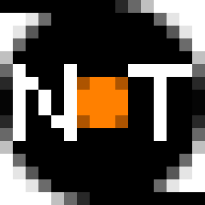

# NeoTape

<p align="center">
  
</p>

A multi-volume backup container for LTO tape drives, with tools to write,
verify and restore it.

This is an early-stage, single-developer project. The on-media format is
`header_version = 1`; it and the command-line interfaces may still change
without backward compatibility.

## The container format

NeoTape wraps a payload byte stream, normally a POSIX pax archive, in fixed-size
tape records. It does not interpret the payload: the concatenated content bytes
of an archive are exactly the stream that went in, so `bsdtar` reads a restored
pax archive directly, and a `zfs send` or `btrfs send` stream would work the
same way.

```text
Archive                 one backup set, identified by archive_uuid
  └─ Volume             one tape (or one spool directory)
       └─ Slice         one tape file, closed by a filemark
            └─ Channel  ch_content or ch_metadata
                 └─ Frame   one tape record: 512-byte header + payload
```

| Property | How the format provides it |
| --- | --- |
| Integrity | Every frame carries a BLAKE3 hash over its whole record. |
| Authenticity | Frames can be signed with Ed25519 using signify-compatible keys. |
| Seeking | Slices are tape files, so the drive's own filemark search reaches any slice. |
| Multiple volumes | Sequence numbers run across volumes. A record the drive did not confirm at end of tape is written again on the next volume, and readers drop the duplicate after checking it is identical. |
| Catalog | A planned archive stores its file list at the start, so its contents can be listed without restoring. |
| Recovery | A volume can begin with a plain tar holding the NeoTape sources, readable without NeoTape. |

The hash and signature algorithms are fixed: one format, one way to read it.
In-volume error correction is left to the drive, and parity across volumes is
out of scope. The [specification](docs/spec/) is authoritative; start with the
[terminology](docs/spec/01-terminology.md) and the
[frame header](docs/spec/02-frame-header.md).

## How an archive is written and read

Producing the stream and driving the tape are separate programs connected by a
TCP or Unix-domain socket. The producer runs for the whole archive; a tape
client runs once per volume and exits when the tape is full, so changing tapes
is simply starting the next client.

```sh
# Plan the slices, then serve the archive.
neotape-plan -C /data -o home.plan photos docs
neotape-archiver --listen unix:///run/neotape/home.sock --plan home.plan

# One writer per tape. Exit status 3 means "insert the next tape and run again".
neotape-write --source unix:///run/neotape/home.sock --target tape:/dev/nst0 --erase

# Restore: one extractor for the archive, one reader per tape.
neotape-extractor --listen unix:///run/neotape/restore.sock -o home.pax
mt -f /dev/nst0 rewind
neotape-read --source tape:/dev/nst0 --connect unix:///run/neotape/restore.sock
```

Tools that read a tape start at its current position and never rewind it. A
`spool:` directory can stand in for a tape everywhere, which is how the test
suite exercises the full pipeline without hardware.

## Tools

Programs are built into `build/<preset>/bin/`. Each one lists its options with
`--help`; the linked sections describe behavior and workflows.

| Command | Description |
| --- | --- |
| [neotape-plan](docs/implementation/cli-tooling.md#planner) | Scan source trees and assign entries to slices ahead of time. |
| [neotape-archiver](docs/implementation/cli-tooling.md#tcp-archive-pipeline) | Serve a pax archive of the sources as NeoTape frames, optionally signed. |
| [neotape-raw-store](docs/implementation/cli-tooling.md#raw-byte-stream-store) | Serve an arbitrary byte stream from stdin as a single-slice archive. |
| [neotape-write](docs/implementation/cli-tooling.md#tcp-archive-pipeline) | Write one volume to a tape or spool, verifying each frame first. |
| [neotape-read](docs/implementation/cli-tooling.md#reader-tcp-client) | Read one volume and forward its records to an extractor. |
| [neotape-extractor](docs/implementation/cli-tooling.md#extractor--reader-reading-pipeline) | Validate the frame stream and rebuild the payload; `--salvage` extracts around damage. |
| [neotape-catalog](docs/implementation/cli-tooling.md#catalog-preview) | Show an archive's catalog, or a plan file, raw or as a listing. |
| [neotape-inspect](docs/implementation/cli-tooling.md#inspect-tool) | Print every frame header of a volume and a compliance report. |
| [neotape-scan](docs/implementation/cli-tooling.md#scan-tool) | List the archives present on a tape by reading the first frame of each tape file. |
| [neotape-dump](docs/implementation/cli-tooling.md#dump-tool) | Copy raw tape records to a spool without any validation. |
| [mt-pax](docs/implementation/cli-tooling.md#standalone-pax-writer) | Multi-threaded pax writer, usable on its own. |

Frame signing and verification options are summarized under
[Signing and verification](docs/implementation/cli-tooling.md#signing-and-verification).

## Building

Requires a C++20 compiler with `<format>` (GCC 13+ or Clang 16+), CMake 3.24+,
Ninja, libarchive, and Catch2 3 for the `dev` preset. BLAKE3 and signify are
bundled as submodules.

```sh
git submodule update --init --recursive
cmake --preset dev
cmake --build --preset dev
ctest --preset dev
```

The `release` preset builds optimized programs without tests. See the
[build notes](docs/implementation/cmake-build-system.md) for details and the
[recovery bundle notes](docs/implementation/recovery-bundle.md) for the
`bot_bundle` target.

## Documentation

- [Documentation index](docs/README.md): where format rules and implementation
  notes live.
- [Specification](docs/spec/): frame header, slices and channels, validation,
  volume and spool layout, socket protocol, security, plan and catalog format.
- [CLI reference](docs/implementation/cli-tooling.md): usage, workflows,
  locators and output conventions.
- [LTO behavior notes](docs/implementation/lto-behavior-notes.md) and the
  [LTO-5 regression report](docs/implementation/lto5-hardware-regression-2026-10-02.md):
  what has been observed and verified on a physical drive.
- [mt-pax architecture](docs/implementation/mt-pax-architecture.md): threads,
  queues and memory bounds of the pax pipeline.

## License

GNU General Public License v3.0 or later. See [LICENSE](LICENSE). Third-party
components retain their own licenses.

## Credits

- [BLAKE3](https://github.com/BLAKE3-team/BLAKE3) for the frame hash.
- [signify](https://github.com/aperezdc/signify), the portable OpenBSD
  `signify`, for Ed25519 signatures and key files.
- [libarchive](https://www.libarchive.org/) for reading the filesystem and
  writing pax.
